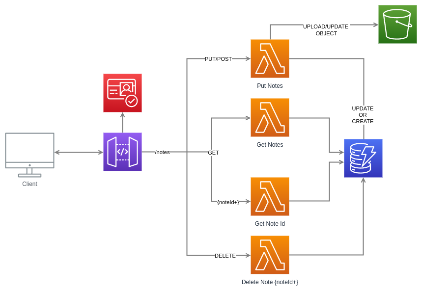

# Serverless API CRUD with AWS CDK

This project demonstrates a serverless CRUD (Create, Read, Update, Delete) API backend using AWS services and Infrastructure as Code (IaC) with AWS CDK and TypeScript.

## Infrastructure Overview

This project sets up the following AWS resources:

1. **Amazon Cognito**: User authentication
2. **Amazon DynamoDB**: NoSQL database for storing notes
3. **AWS Lambda**: Serverless functions for API logic
4. **Amazon API Gateway**: RESTful API endpoints
5. **Amazon S3**: Storage for file uploads





## Project Structure

The project is organized into the following directories:

```plaintext
lib/
├── api
│   ├── cors.ts
│   ├── createApiGateway.ts
│   ├── types.ts
│   └── validators.ts
├── api-crud-serverless-cdk-stack.ts
├── auth
│   └── createCognitoIAM.ts
├── dynamo_db
│   └── createDynamoDb.ts
├── lambdas
│   ├── delete_notes
│   │   ├── construct.ts
│   │   └── main.ts
│   ├── get_note_id
│   │   ├── construct.ts
│   │   └── main.ts
│   ├── get_notes
│   │   ├── construct.ts
│   │   └── main.ts
│   ├── put_notes
│   │   ├── construct.ts
│   │   └── main.ts
│   └── utils
│       ├── s3_utils.ts
│       └── utils.ts
└── s3
    └── createBucketS3.ts
```

## Key Components

### API Gateway

The API Gateway is created using the `createApiGateway` function, which sets up the following endpoints:

| Endpoint             | Method | Description              |
| -------------------- | ------ | ------------------------ |
| `/v1/notes`          | GET    | Retrieve all notes       |
| `/v1/notes`          | POST   | Create a new note        |
| `/v1/notes/{noteId}` | GET    | Retrieve a specific note |
| `/v1/notes/{noteId}` | PUT    | Update a specific note   |
| `/v1/notes/{noteId}` | DELETE | Delete a specific note   |

Each endpoint is protected by a Cognito User Pool Authorizer and includes request validators.

### DynamoDB

The DynamoDB table is created with the following configuration:

- Table Name: UserNotes
- Partition Key: userId (String)
- Sort Key: noteId (String)
- Billing Mode: PAY_PER_REQUEST (On-Demand)
- Encryption: AWS Managed
- Time to Live (TTL) Attribute: ttl

Global Secondary Indexes:
1. TitleIndex: For querying notes by title
2. CreatedAtIndex: For querying notes by creation date

### Lambda Functions

Four Lambda functions handle the CRUD operations:

1. `Lambda-Get-Notes`: 
   - Retrieves all notes for a specific user
   - Generates presigned URLs for associated S3 objects
   - Returns an array of note objects, including title, content, creation date, and presigned URL (if applicable)

2. `Lambda-Get-Note-Id`: 
   - Retrieves a specific note by user ID and note ID
   - Generates a presigned URL for the associated S3 object (if applicable)
   - Returns a single note object with all details

3. `Lambda-Put-Notes`: 
   - Creates a new note or updates an existing one
   - Handles file uploads to S3
   - Supports both creation (POST) and update (PUT) operations
   - Generates a new UUID for new notes
   - Updates existing notes if a noteId is provided
   - Stores note metadata in DynamoDB, including S3 key for uploaded files

4. `Lambda-Delete-Notes`: 
   - Deletes a specific note by user ID and note ID
   - Returns the deleted note's attributes

All Lambda functions include comprehensive error handling and logging.

### S3 File Storage

The project uses Amazon S3 for storing files associated with notes. Here are the key aspects of the S3 integration:

1. **Bucket Structure**: 
   Files are stored in the following structure:
   `user-{userId}/noteId-{noteId}/{originalFileName}`

2. **File Upload Process**:
   - When creating or updating a note, if a `filePath` is provided in the request:
     1. The original file name is extracted from the `filePath`
     2. An S3 key is generated in the format: `user-{userId}/noteId-{noteId}/{originalFileName}`
     3. The file is uploaded to S3 using this key
     4. The S3 key is stored in the DynamoDB record for the note

3. **File Access**:
   - When retrieving notes, the Lambda functions generate presigned URLs for any associated S3 objects
   - These presigned URLs are included in the response, allowing temporary, secure access to the files

4. **Security**:
   - Direct access to the S3 bucket is restricted
   - Files are accessed only through presigned URLs generated by the Lambda functions
   - Presigned URLs have a limited validity period for enhanced security

Note: Ensure that the S3 bucket has the appropriate CORS (Cross-Origin Resource Sharing) configuration if you plan to access the files directly from a web application.

### Authentication

User authentication is handled by Amazon Cognito. The `createCognitoIAM` function sets up a Cognito User Pool with the following configuration:

- Self sign-up enabled
- Email as the primary sign-in alias
- Email verification required
- Password policy:
  - Minimum length: 8 characters
  - Requires lowercase, uppercase, digits, and symbols
- Account recovery via email only
- OAuth 2.0 authorization code grant flow
- OpenID Connect scope

A Cognito User Pool Client is created without a client secret, supporting user password and SRP (Secure Remote Password) authentication flows.

A custom domain is set up for the Cognito User Pool using the provided domain prefix.

### Usage

### Prerequisites

1. Install Node.js (version 18.x or latest)
2. Install AWS CLI and configure it with your AWS credentials
3. Install AWS CDK CLI: `npm install -g aws-cdk`

### Deployment

To deploy this stack:

1. Clone this repository:
   ```bash 
   mkdir api-crud-serverless-cdk
   git clone https://github.com/your-username/api-crud-serverless-cdk.git
   cd api-crud-serverless-cdk
   ```

2. Remove the existing `.git` directory to start with a fresh history:
   ```bash
   rm -rf .git
   ```

3. Install dependencies:
   ```bash
   npm install
   ```

4. Bootstrap the CDK environment (if you haven't already):
   ```bash
   cdk bootstrap --profile your-profile-name
   ```

5. Deploy the stack:
   ```bash
   cdk deploy
   ```

### Testing

After deployment, you can test the API using various methods. Here's how to get started:

#### 1. Create a Cognito User and Obtain a Token

Before testing, you need to create a new user in Cognito and authenticate to obtain an access token:

1. Go to the AWS Console and navigate to the Cognito service.
2. Find your User Pool and create a new user.
3. Follow the authentication process to obtain an access token.

#### 2. Test Using curl or Postman

Once you have the token, you can make requests to your API. Here's an example using curl:

```bash
curl -X GET https://your-api-id.execute-api.your-region.amazonaws.com/prod/v1/notes \
-H "Authorization: Bearer YOUR_TOKEN_HERE"
```

Replace `your-api-id`, `your-region`, and `YOUR_TOKEN_HERE` with your actual values.

Test other endpoints (POST, PUT, DELETE) in a similar manner, providing the necessary data in the request body for POST and PUT requests.

#### 3. Test Using AWS Console
You can also test your Lambda functions directly from the AWS Console:

1. Go to the AWS Console and navigate to the Lambda service.
2. Select the Lambda function you want to test.
3. Click on the "Test" tab.
4. Choose "API Gateway AWS Proxy" as the event template.
5. For PUT and POST requests, add the necessary body to the event JSON.
6. Click "Test" to run the function and see the results.

## Cleanup

To avoid incurring future charges, remember to destroy the stack when you're done:

Destroy the stack:

```bash
cdk destroy
```

This command will show you a summary of the resources that will be destroyed and ask for confirmation. After confirmation, CDK will delete all the resources created by this stack.

**Note:** Destroying the stack will delete all data in the DynamoDB table and files in the S3 bucket. Make sure to backup any important data before destroying the stack.

## Troubleshooting

If you encounter any issues during deployment, check the CloudFormation console in the AWS Management Console for error messages.

For API Gateway issues, you can enable CloudWatch Logs for API Gateway and check the logs for more detailed error information.

For Lambda function issues, check the CloudWatch Logs for each Lambda function.

## Security

- All API endpoints are protected with Cognito User Pool authentication.
- DynamoDB uses AWS managed encryption.
- S3 bucket permissions should be configured to restrict access as needed.

## Notes

- This is a demo project and may need additional security measures for production use.
- Ensure proper IAM permissions are set up for the Lambda functions to access DynamoDB and S3.
- Consider enabling DynamoDB Streams and Point-in-Time Recovery for production environments.


